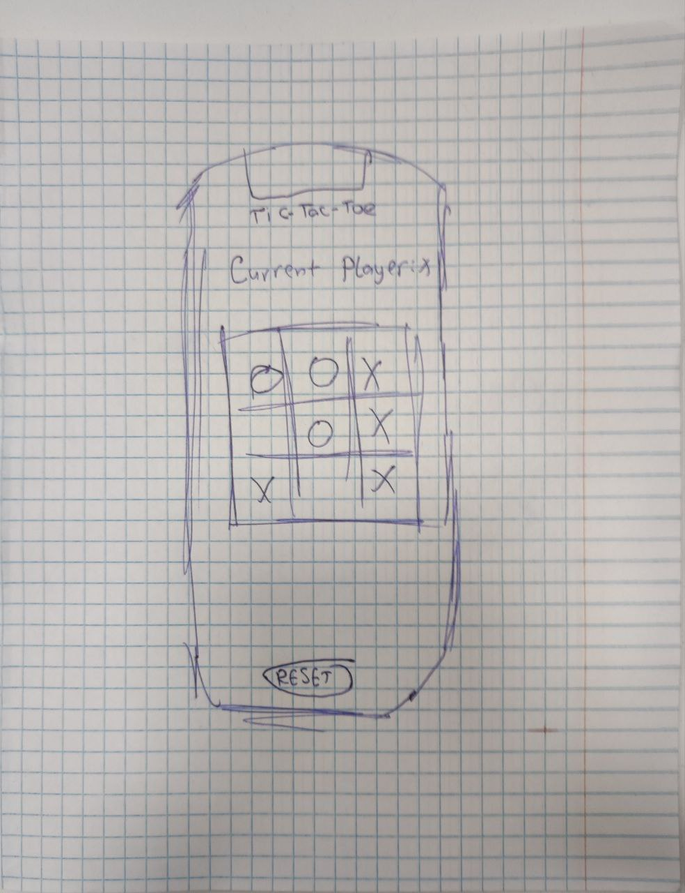

## Tic-Tac-Toe Game

This is a simple implementation of the classic Tic-Tac-Toe game using Flutter and Dart. The game allows two players to take turns marking cells on a 3x3 grid, aiming to get three of their marks in a row horizontally, vertically, or diagonally.

### Prototype

### Features

1. **Two Player Game**: Players take turns marking cells with their respective symbols ('X' and 'O').
2. **Win Detection**: The game automatically detects when a player has won by getting three marks in a row.
3. **Draw Detection**: If all cells are filled without a winner, the game declares a draw.
4. **Reset Option**: Players can reset the game at any time to start a new round.

### How to Play

1. Launch the game.
2. The current player is displayed at the top.
3. Tap on an empty cell to mark it with your symbol.
4. The game automatically switches to the next player after each move.
5. If a player wins or the game ends in a draw, a dialog appears with the result.
6. Press "Play Again" to reset the game and start over.

### Code Structure

- **`main()` Function**: Entry point of the Flutter app, initializes the TicTacToeApp.
- **`TicTacToeApp` Class (StatelessWidget)**: Sets up the MaterialApp and directs to the TicTacToeGame as the home screen.
- **`TicTacToeGame` Class (StatefulWidget)**: Manages the game state, including the game board, current player, and game logic.
  - `initState()`: Initializes the game board when the widget is created.
  - `initializeGame()`: Sets up the initial state of the game board.
  - `onCellTapped(int row, int col)`: Handles cell taps and updates the board.
  - `checkForWinner()`: Checks for a winner or a draw after each move.
  - `showWinnerDialog(String winner)`: Displays a dialog with the game result.
  - `resetGame()`: Resets the game to its initial state.
  - `build(BuildContext context)`: Builds the UI for the game screen.
    - Displays the current player.
    - Shows the game board as a grid of cells.
    - Provides a button to reset the game.

### Folder Structure

- **`assets/`**: Contains the images for 'X' and 'O' symbols.
- **`pubspec.yaml`**: Specifies dependencies and asset paths.

### How to Run

1. Ensure Flutter and Dart are installed on your machine.
2. Clone the project and navigate to its directory.
3. Run `flutter pub get` to install dependencies.
4. Connect a device or start an emulator.
5. Run `flutter run` to launch the game on the device/emulator.

Enjoy playing Tic-Tac-Toe!
